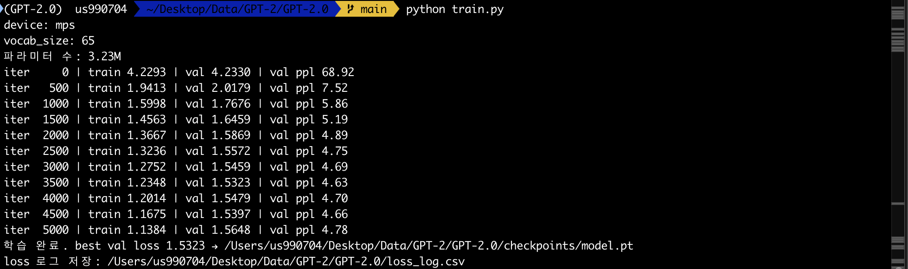
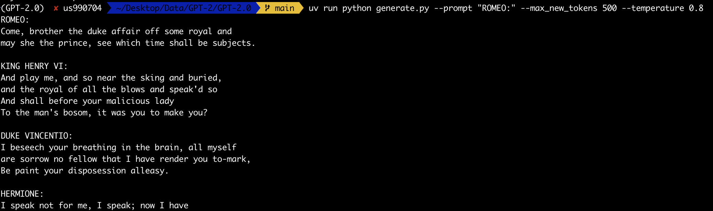

# 미니 GPT-2: Transformer Decoder 직접 구현 및 학습 보고서

> GPT-2의 핵심 구조인 **Transformer Decoder**를 PyTorch로 직접 구현하고,
> Tiny Shakespeare 데이터로 학습시켜 문장 생성 능력을 검증한 과제 보고서.

---

## 1. 개요

| 항목 | 내용 |
|------|------|
| 과제 목표 | GPT-2 수준 언어모델을 외부 라이브러리 없이 직접 구현·학습 |
| 만든 것 | nanoGPT 규모 미니 GPT-2 (**약 3.23M 파라미터**, GPT-2 small의 약 1/38) |
| 데이터 | Tiny Shakespeare (약 1.1M 문자), **문자 단위(char-level)** 토큰화, vocab 65 |
| 학습 환경 | Apple Silicon GPU (**MPS**), 5,000 iteration |
| 핵심 결과 | val loss 4.23 → **1.53**, Perplexity 68.9 → **4.6** |

"앞 토큰들을 보고 다음 토큰을 맞춘다"는 단일 목표만으로 학습했으며, 학습 후 모델이
셰익스피어 희곡의 형식(인물명·대사 구조)을 스스로 재현하는 것을 확인했다.

---

## 2. 모델 구조

```
입력 토큰 → 토큰 임베딩 + 위치 임베딩
   → [Transformer Block × 4] → LayerNorm → LM Head → 다음 토큰 확률
```

| 부품 | 역할 | 구현 위치 |
|------|------|-----------|
| 토큰/위치 임베딩 | 정수 ID → 벡터, 위치 정보 추가 | `model.py` `GPT.__init__` |
| Causal Self-Attention | 단어 간 참고(미래는 `tril` 마스크로 차단) | `CausalSelfAttention` |
| Multi-Head | 4개 헤드로 다양한 관점 동시 attention | 同 |
| Feed Forward | Linear → GELU → Linear (토큰별 비선형 변환) | `FeedForward` |
| LayerNorm + Residual | 학습 안정화 + 깊은 네트워크 학습 | `Block` (pre-norm) |
| LM Head | 최종 벡터 → 어휘(65) 확률 | `GPT.forward` |

GPT-2의 결정적 특징인 **Causal Mask**(미래 토큰을 못 보게 막는 하삼각 마스크)를
적용해, BERT 같은 양방향 모델이 아닌 **자기회귀(autoregressive)** 언어모델로 동작한다.

---

## 3. 학습 설정

| 하이퍼파라미터 | 값 | | 하이퍼파라미터 | 값 |
|---|---|---|---|---|
| n_layer | 4 | | batch_size | 32 |
| n_embd | 256 | | max_iters | 5,000 |
| n_head | 4 | | learning rate | 3e-4 (AdamW) |
| block_size | 128 | | device | MPS |

손실 함수는 cross-entropy, 옵티마이저는 AdamW를 사용했다. 500 step마다 train/val
loss를 함께 측정해 과적합을 모니터링하고, val loss 최저 시점에 체크포인트를 저장했다.
설정값은 모두 `config.py`에 정의되어 있다.

---

## 4. 학습 결과

학습 로그 (실제 실행 화면):



`loss_log.csv` 기준 주요 구간:

| iter | train loss | val loss | val perplexity |
|------|-----------|----------|----------------|
| 0 | 4.229 | 4.233 | 68.9 |
| 500 | 1.941 | 2.018 | 7.5 |
| 1,500 | 1.456 | 1.646 | 5.2 |
| 3,500 | 1.235 | **1.532** | **4.63** |
| 5,000 | 1.138 | 1.565 | 4.78 |

- **Perplexity가 68.9 → 4.6으로 약 15배 감소**했다. 모델이 다음 문자를 평균적으로
  약 5개 후보 수준으로 좁혀 예측하게 되었음을 의미한다.
- val loss는 **iter ≈ 3,500에서 최저(1.5323)** 를 찍은 뒤 소폭 반등했다. train loss는
  계속 하락하므로, 이 구간부터 **과적합**이 시작된 것으로 해석된다. best 체크포인트는
  최저 시점 기준으로 저장된다.

---

## 5. 생성 예시 (Before / After)

동일 프롬프트 `"ROMEO:"` 로 학습 전·후 생성 결과를 비교했다 (실제 `generate.py` 출력).

**Before — 학습 전 (랜덤 초기화):**

```
ROMEO:bLcPSKzAbZzCHKfVz;SnvYTSqkhJ.Vw&zubTCCYiTgu;TPcipxNnmn$ek-OReg'rkU
q;.SgQHLO3pQhy?sACO; dj'cqKfcORTuv,,Y:zbcV$XXNLOV r?RwV$Iq ...
```

**After — 학습 후 (5,000 iter):**

```
ROMEO:
O you are envy away.

LUCIO:
Horten the fine and with so blinding warm.

LEONTES:
What no more? Call upons him, that war? nou it;
And therefore and comes to your gage:
Then you are pime you ourself that hands
```

실제 실행 화면 (`--prompt "ROMEO:" --max_new_tokens 500 --temperature 0.8`):



위 출력에서 보듯 **ROMEO · KING HENRY VI · DUKE VINCENTIO · HERMIONE** 등 여러 인물이
번갈아 등장하며, 각 인물의 대사가 콜론 뒤에 줄바꿈과 함께 이어진다.

학습 전에는 의미 없는 문자 나열이지만, 학습 후에는 **인물명(ROMEO/LUCIO/LEONTES) →
콜론 → 대사 → 빈 줄**이라는 희곡 형식과 영어 단어·구문 구조를 재현한다. 개별 단어에
오타가 있는 것은 문자 단위·소규모 모델의 한계이며, **형식과 패턴 자체는 명확히 학습**됐다.

---

## 6. 결론 및 배운 점

- "다음 토큰 예측"이라는 단순 목표만으로, 명시적 문법 규칙 없이도 문장 형식·구조가
  **emergent하게** 나타남을 직접 확인했다 — GPT 계열 모델의 핵심 직관.
- Causal mask, pre-norm + residual, multi-head attention 등 GPT-2의 핵심 구성요소를
  외부 모델 라이브러리 없이 PyTorch로 구현하며 내부 동작을 이해했다.
- val loss 반등으로 **과적합 시점을 정량적으로 포착**했고, 체크포인트/조기 종료의
  필요성을 실험적으로 체감했다. 향후 dropout·데이터 증강·모델 축소로 개선 가능하다.

---

## 7. 실행 방법

```bash
uv run python data/prepare.py     # 데이터 준비 (train.bin / val.bin)
uv run python train.py            # 학습 → checkpoints/model.pt
uv run python generate.py --prompt "ROMEO:" --temperature 0.8
```

코드 구조와 모듈 설명은 [../README.md](../README.md) 참조.
