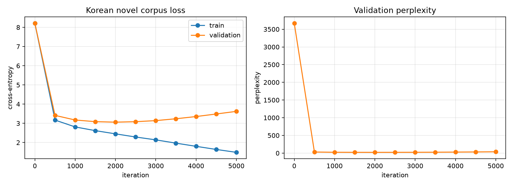

# 미니 GPT-2: 한국어 공개 고전소설 학습 보고서

> Transformer Decoder를 PyTorch로 직접 구현하고, Tiny Shakespeare 대신
> 한국어 위키문헌의 공개 고전소설로 학습시킨 결과를 정리한다.

## 1. 개요

| 항목 | 내용 |
|---|---|
| 과제 목표 | GPT-2 핵심 구조를 직접 구현하고 새로운 데이터셋으로 학습 |
| 모델 | 4-layer char-level 미니 GPT-2, **4,889,324 파라미터** |
| 데이터 | 한국어 공개 고전소설 62편, 정제 본문 1,019,129자 |
| 작가 | 김동인, 현진건, 나도향, 최서해, 이상 |
| 토큰화 | 문자 단위, vocab **3,308** |
| 학습 환경 | CPU, 5,000 iteration |
| 핵심 결과 | val loss 8.2070 → **3.0612**, perplexity 3666.66 → **21.35** |

기존 Tiny Shakespeare 전용 다운로드를 제거하고, 저작권 보호기간이 끝난 한국 작가의
소설을 한국어 위키문헌 API에서 수집하는 파이프라인을 구현했다. 모델 구조와 문자 단위
토큰화는 유지해 데이터셋 변경에 집중했다.

## 2. 데이터셋과 재현성

`data/prepare.py`는 각 작가의 `저자:` 문서를 참조하는 페이지 중 위키문헌의 소설 분류가
붙은 본문만 선택한다. HTML과 라이선스 안내를 제거하고 Unicode NFC 및 공백을 정규화한다.

| 항목 | 결과 |
|---|---:|
| 작품 수 | 62편 |
| 정제 본문 | 1,019,129자 |
| 모델 입력 전체 | 1,020,855자 |
| train | 53편, 869,304 토큰 |
| validation | 9편, 151,551 토큰 |
| vocab | 3,308자 |

작품 단위로 train/validation을 분리해 같은 작품의 인접 문장이 양쪽에 섞이지 않도록 했다.
각 문서의 제목, URL, revision ID, 문자 수, 작가, split, 라이선스 정보는
`data/sources.json`에 기록한다. 기본 실행은 이 revision 목록을 재사용하고,
`--refresh`를 지정할 때만 작품을 다시 검색한다.

## 3. 모델과 학습 설정

```
입력 문자 → 토큰 임베딩 + 위치 임베딩
  → [Causal Self-Attention + FFN] × 4
  → LayerNorm → LM Head → 다음 문자 확률
```

| 항목 | 값 | 항목 | 값 |
|---|---:|---|---:|
| n_layer | 4 | batch_size | 32 |
| n_embd | 256 | block_size | 128 |
| n_head | 4 | learning rate | 3e-4 |
| max_iters | 5,000 | optimizer | AdamW |

500 iteration마다 train/validation loss를 평가하고, validation loss가 가장 낮은 모델만
`checkpoints/model.pt`에 저장했다.

## 4. 학습 결과

전체 5,000 iteration 학습 실행 화면:


| iter | train loss | val loss | val perplexity |
|---:|---:|---:|---:|
| 0 | 8.2068 | 8.2070 | 3666.66 |
| 500 | 3.1698 | 3.4141 | 30.39 |
| 1,000 | 2.8130 | 3.1731 | 23.88 |
| 1,500 | 2.6194 | 3.0878 | 21.93 |
| **2,000** | **2.4528** | **3.0612** | **21.35** |
| 3,500 | 1.9689 | 3.2386 | 25.50 |
| 5,000 | 1.4892 | 3.6230 | 37.45 |



초기 대비 best validation perplexity가 약 172분의 1로 감소했다. 2,000 iteration 이후에는
train loss만 계속 감소하고 validation loss는 상승하므로 과적합이 시작됐다고 판단할 수
있다. 체크포인트는 자동으로 2,000 iteration의 best 모델을 유지한다.

Tiny Shakespeare의 vocab은 65자였지만 이번 한국어 코퍼스는 한글과 한자를 포함해
3,308자다. 따라서 두 데이터셋의 perplexity 절대값을 직접 비교하는 것은 적절하지 않으며,
같은 코퍼스에서 학습 전후의 감소 추세를 평가했다.

## 5. 생성 결과

best 체크포인트에 `"그는"` 프롬프트를 주고 `temperature=0.8`, `top_k=50`으로 생성했다.

```text
그는 한 마위 위에 또 물어보시는 것을 기회를 바르는 것이다.

그러나 이 기쁘다고 별명을 한 장이 남아야 할 수 없는 이것이 아니라.
자기가 좀 부쩍 뜨이지 않고 이 나날이 지어 오셨읍니까.

"이 그래요?"

"그래 왜 그럴 줄 아시오."
```

실제 생성 실행 화면:


모델은 한국어 음절, 문단, 인용 부호, 대화 형식, 고전적인 어미를 학습했다. 다만 작은
char-level 모델이라 장기 문맥과 문장 의미의 일관성은 부족하다.

## 6. 결론과 개선 방향

- Tiny Shakespeare 의존성을 제거하고 출처와 revision이 기록된 한국어 코퍼스를 구축했다.
- 문자 단위 GPT가 한국어 표면 형식과 문체를 학습하는 것을 loss와 생성 결과로 확인했다.
- 작품 단위 validation을 적용해 단순한 인접 문장 누출을 줄였다.
- 향후에는 early stopping, dropout, 더 큰 코퍼스, BPE 토크나이저로 과적합과 장기 문맥을
  개선할 수 있다.

## 7. 실행 방법

```bash
python data/prepare.py
python train.py
python generate.py --prompt "그는" --temperature 0.8 --top_k 50
python docs/plot_loss.py
```
